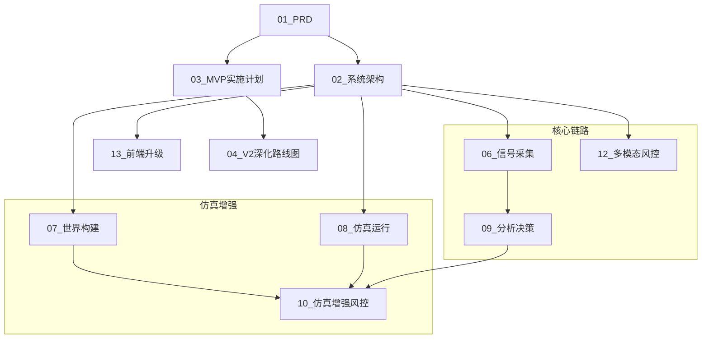

# VibeUtopia 文档索引与阅读指引 (00)

## 1. 文档地图与依赖关系

---

## 2. 阅读路径推荐

### 🏁 我是决策者/产品经理 (关注价值与边界)
1. **[01_产品需求文档(PRD)](./01_产品需求文档(PRD).md)**: 了解 VibeUtopia 是做什么的，解决什么痛点。
2. **[04_V2深化路线图](./04_V2深化路线图.md)**: 了解项目的演进阶段与长期愿景。
3. **[14_博主附加服务设计](./14_博主附加服务设计.md)**: 了解商业化潜力。

### 💻 我是后端/算法开发 (关注实现细节)
1. **[02_系统架构设计](./02_系统架构设计.md)**: 掌握整体技术栈与硬件自适应策略。
2. **[12_多模态风控设计](./12_多模态风控设计.md)**: 了解如何解析视频、OCR 和音频。
3. **[09_分析决策层设计](./09_分析决策层设计.md)**: 核心风险评估逻辑与证据链生成。
4. **[07_世界构建](./07_世界构建层设计.md)** & **[08_仿真运行](./08_仿真运行层设计.md)**: 深入 Agent 仿真内核。

### 🎨 我是前端开发
1. **[13_前端升级设计](./13_前端升级设计.md)**: 掌握三面板布局与 WebSocket 通信协议。

---

## 3. 核心术语表 (Glossary)

| 术语 | 定义 |
|------|------|
| **7维风控** | 法律合规、价值观倾向、事实错误、敏感实体、情绪极化、隐喻反讽、平台禁区。 |
| **证据链 (Evidence Chain)** | 支撑风险结论的底层原始数据（如：视频第32秒出现的特定旗帜）。 |
| **Tier (层级)** | 硬件自适应等级 (Lite/Standard/Pro/Ultra)，决定本地/API 模型比例。 |
| **GA-S3** | Group-Agent-Sub-Social-System，万级 Agent 仿真的分群管理机制。 |
| **Dream Cycle** | 记忆整合循环。Agent 在非活动期对 Episodic Memory 进行摘要与 Semantic 蒸馏。 |
| **GraphRAG** | 结合图数据库(Neo4j)与向量数据库(ChromaDB)的增强检索机制。 |

---

## 4. 快速导航清单

- 基础建设: [02_系统架构](./02_系统架构设计.md), [16_环境搭建](./16_开发环境搭建指南.md), [17_代码规范](./17_代码目录规范.md)
- 核心功能: [12_多模态](./12_多模态风控设计.md), [09_分析决策](./09_分析决策层设计.md), [06_信号采集](./06_信号采集层设计.md)
- 仿真模块: [07_世界构建](./07_世界构建层设计.md), [08_仿真运行](./08_仿真运行层设计.md), [10_仿真增强](./10_仿真增强风控设计.md)
- 规划验收: [03_MVP任务](./03_MVP实施计划(Tasks).md), [11_验证迁移](./11_仿真验证与基础迁移设计.md), [15_状态待办](./15_环境与待办事项.md)
