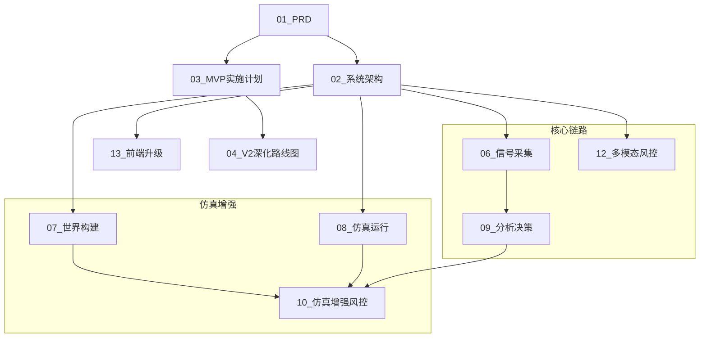

# VibeUtopia 文档索引与阅读指引

## 1. 文档地图与依赖关系

---

## 2. 阅读路径推荐

### 🏁 我是决策者/产品经理 (关注价值与边界)
1. **[01_产品需求文档(PRD)](./01_产品需求文档(PRD).md)**: 了解 VibeUtopia 是做什么的，解决什么痛点。
2. **[04_V2深化路线图](./04_V2深化路线图.md)**: 了解项目的演进阶段与长期愿景。
3. **[14_博主附加服务设计](./14_博主附加服务设计.md)**: 了解商业化潜力。

### 💻 我是后端/算法开发 (关注实现细节)
1. **[02_系统架构设计](./02_系统架构设计.md)**: 掌握整体技术栈与硬件自适应策略。
2. **[12_多模态风控设计](./12_多模态风控设计.md)**: 了解如何解析视频、OCR 和音频。
3. **[09_分析决策层设计](./09_分析决策层设计.md)**: 核心风险评估逻辑与证据链生成。
4. **[07_世界构建](./07_世界构建层设计.md)** & **[08_仿真运行](./08_仿真运行层设计.md)**: 深入 Agent 仿真内核。

### 🎨 我是前端开发
1. **[13_前端升级设计](./13_前端升级设计.md)**: 掌握三面板布局与 WebSocket 通信协议。

### 🚀 我是运维/部署
1. **[DEPLOYMENT_GUIDE](./DEPLOYMENT_GUIDE.md)**: 生产环境部署指南。
2. **[OPS_MANUAL](./OPS_MANUAL.md)**: 运维监控手册。

### 📖 我是最终用户
1. **[USER_MANUAL](./USER_MANUAL.md)**: 用户操作手册。

---

## 3. 核心术语表 (Glossary)

| 术语 | 定义 |
|------|------|
| **7维风控** | 法律合规、价值观倾向、事实错误、敏感实体、情绪极化、隐喻反讽、平台禁区。 |
| **证据链 (Evidence Chain)** | 支撑风险结论的底层原始数据（如：视频第32秒出现的特定旗帜）。 |
| **Tier (层级)** | 硬件自适应等级 (Lite/Standard/Pro/Ultra)，决定本地/API 模型比例。 |
| **GA-S3** | Group-Agent-Sub-Social-System，万级 Agent 仿真的分群管理机制。 |
| **Dream Cycle** | 记忆整合循环。Agent 在非活动期对 Episodic Memory 进行摘要与 Semantic 蒸馏。 |
| **GraphRAG** | 结合图数据库(Neo4j)与向量数据库(ChromaDB)的增强检索机制。 |

---

## 4. 文档分类索引

### 设计文档（编号 01-17）
| 编号 | 文档 | 说明 |
|------|------|------|
| 01 | [产品需求文档(PRD)](./01_产品需求文档(PRD).md) | 产品定位、核心功能、差异化 |
| 02 | [系统架构设计](./02_系统架构设计.md) | 五层架构、技术栈、硬件自适应 |
| 03 | [MVP实施计划](./03_MVP实施计划(Tasks).md) | MVP任务分解与优先级 |
| 04 | [V2深化路线图](./04_V2深化路线图.md) | 6阶段演进路线 |
| 05 | [参考项目分析](./05_参考项目分析与精华提炼.md) | 5个参考项目精华提炼 |
| 06 | [信号采集层设计](./06_信号采集层设计.md) | 热搜聚合、事件检测、深度爬取 |
| 07 | [世界构建层设计](./07_世界构建层设计.md) | 知识图谱、7层人格、社会网络 |
| 08 | [仿真运行层设计](./08_仿真运行层设计.md) | 仿真引擎、传播动力学 |
| 09 | [分析决策层设计](./09_分析决策层设计.md) | 风险评估、趋势预测、报告生成 |
| 10 | [仿真增强风控设计](./10_仿真增强风控设计.md) | 仿真与风控融合 |
| 11 | [仿真验证与基础迁移](./11_仿真验证与基础迁移设计.md) | 验证方法论 |
| 12 | [多模态风控设计](./12_多模态风控设计.md) | 关键帧、OCR、音频转写 |
| 13 | [前端升级设计](./13_前端升级设计.md) | 三面板布局、WebSocket |
| 14 | [博主附加服务设计](./14_博主附加服务设计.md) | 博主画像、选题推荐 |
| 15 | [环境与待办事项](./15_环境与待办事项.md) | 开发环境配置 |
| 16 | [开发环境搭建指南](./16_开发环境搭建指南.md) | 环境搭建步骤 |
| 17 | [代码目录规范](./17_代码目录规范.md) | 目录结构规范 |

### ChromaDB 专题
| 文档 | 说明 |
|------|------|
| [18_ChromaDB部署与Memory Stream设计](./18_ChromaDB%20部署与%20Memory%20Stream%20设计.md) | ChromaDB部署方案 |
| [19_ChromaDB实施报告](./19_ChromaDB%20实施报告.md) | 实施过程记录 |
| [20_Memory_Stream初始化报告](./20_Memory_Stream初始化报告.md) | 初始化验证报告 |

### 运维与用户文档
| 文档 | 说明 |
|------|------|
| [API_REFERENCE](./API_REFERENCE.md) | 完整API参考文档（50+端点） |
| [DEPLOYMENT_GUIDE](./DEPLOYMENT_GUIDE.md) | 生产环境部署指南 |
| [USER_MANUAL](./USER_MANUAL.md) | 用户操作手册 |
| [OPS_MANUAL](./OPS_MANUAL.md) | 运维监控手册 |
| [PROJECT_COMPLETION_REPORT](./PROJECT_COMPLETION_REPORT.md) | 项目完成报告 |

### 原始需求
| 文档 | 说明 |
|------|------|
| [原始需求](./原始需求.md) | 项目原始需求文档 |
