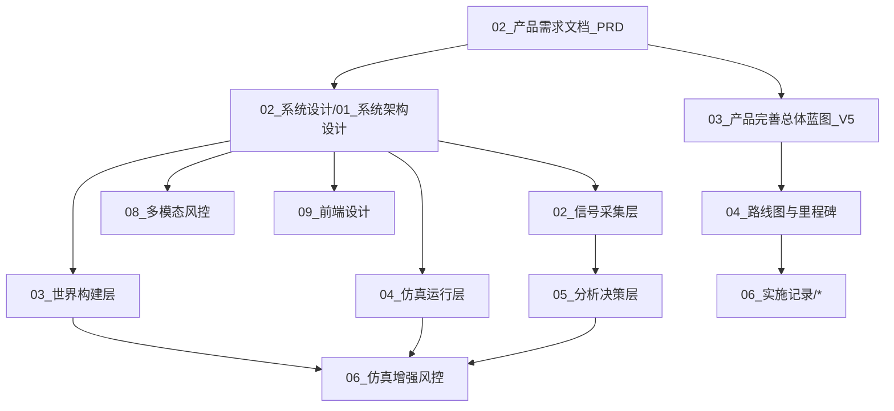

# VibeUtopia 文档总索引

> **文档定位**：全库唯一入口｜分层目录树、逐篇一句话说明与推荐阅读路径
> **所属目录**：`docs/`

本索引覆盖 `docs/` 下全部文档。目录按角色分层，层内再用 `NN_中文标题.md` 编号；
历史编号冲突已在重构中消除，旧路径对照见 [00_文档重构对照表](./06_实施记录/00_文档重构对照表.md)。

---

## 1. 目录树

```
docs/
  README.md                         # 本文件（总索引，唯一入口）
  01_产品与需求/
    01_原始需求.md
    02_产品需求文档_PRD.md
    03_产品完善总体蓝图_V5.md
    04_路线图与里程碑.md
    05_MVP实施计划.md
    06_实施计划与验收标准.md
    # 原始想法、PRD、V5 蓝图、路线图与实施计划
  02_系统设计/
    01_系统架构设计.md
    02_信号采集层.md
    03_世界构建层.md
    04_仿真运行层.md
    05_分析决策层.md
    06_仿真增强风控.md
    07_仿真验证与迁移.md
    08_多模态风控.md
    09_前端设计.md
    10_博主服务.md
    11_ChromaDB与记忆.md
    12_博主知识引擎.md
    13_细粒度视频理解.md
    14_第一性原理视频理解架构.md
    # 五层架构与各专项模块设计
  03_使用与运维/
    01_开发环境搭建.md
    02_API参考.md
    03_部署指南.md
    04_运维手册.md
    05_用户手册.md
    # 环境搭建、API、部署、运维与用户手册
  04_规范与工程/
    01_开发管理规范.md
    02_代码目录规范.md
    03_环境与待办.md
    04_开发环境管理规范.md
    # 开发管理、目录规范、环境待办与开发环境管理
  05_调研审计/
    00_统一评审与优先级总控.md
    01_产品需求差距分析.md
    02_UX交互体验审计.md
    03_UI视觉体系审计.md
    04_前端工程质量审计.md
    05_后端架构与API审计.md
    06_风控算法可信度审计.md
    07_多模态视频理解审计.md
    08_仿真与人格系统审计.md
    09_QA测试体系审计.md
    10_基础设施与DevOps审计.md
    11_合规与内容安全审计.md
    12_竞品与商业化调研.md
    13_文档体系与上手体验审计.md
    14_性能与指标体系报告.md
    15_第一性原理视频理解调研.md
    16_论文与项目精华集成.md
    17_安全工程审计.md
    18_创作者体验与增长路径.md
    # 多角色深度审计与调研（原 audit 00–18）
  06_实施记录/
    00_文档重构对照表.md
    01_前端P0改造.md
    02_后端P0修复.md
    03_DX与测试修复.md
    04_安全加固.md
    05_仿真引擎修复.md
    06_合规与主流程闭环.md
    07_算法核心P0修复.md
    08_R2可信度量.md
    09_R3视频事件级.md
    10_遗留P0安全与规则.md
    # P0/R2/R3 改造实施记录（原 audit 19–28）
  07_研究与参考/
    01_参考项目分析与精华提炼.md
    02_参考资源索引.md
    03_技术白皮书.md
    04_平台兼容性与最优模型方案.md
    # 参考项目分析、资源索引、白皮书与平台方案
  08_阶段报告/
    01_ChromaDB实施报告.md
    02_Memory_Stream初始化报告.md
    03_DeepSeek_V4_Flash集成报告.md
    04_项目完成报告.md
    05_Phase3_AB测试验证.md
    06_Phase3最终验收.md
    07_Phase5验收.md
    08_Phase6验收.md
    # ChromaDB/Memory Stream/DeepSeek/Phase 验收报告
```

---

## 2. 分层索引

### 产品与需求 `docs/01_产品与需求/`

原始想法、PRD、V5 蓝图、路线图与实施计划。

| 文档 | 说明 |
|------|------|
| [原始需求](./01_产品与需求/01_原始需求.md) | 项目最初的产品想法、四条核心诉求与开源参考项目清单 |
| [产品需求文档 PRD](./01_产品与需求/02_产品需求文档_PRD.md) | 产品定位、核心功能、差异化与非目标 |
| [产品完善总体蓝图 V5](./01_产品与需求/03_产品完善总体蓝图_V5.md) | V5 产品蓝图：创作者发布前 3 分钟决策助手 |
| [路线图与里程碑](./01_产品与需求/04_路线图与里程碑.md) | 阶段演进路线、里程碑与长期愿景 |
| [MVP实施计划](./01_产品与需求/05_MVP实施计划.md) | MVP 任务分解、优先级与验收口径 |
| [实施计划与验收标准](./01_产品与需求/06_实施计划与验收标准.md) | V5.1–V5.5 实施计划与各阶段验收标准 |

### 系统设计 `docs/02_系统设计/`

五层架构与各专项模块设计。

| 文档 | 说明 |
|------|------|
| [系统架构设计](./02_系统设计/01_系统架构设计.md) | 五层架构、技术栈、数据模型、硬件自适应与部署架构 |
| [信号采集层](./02_系统设计/02_信号采集层.md) | 热搜聚合、事件检测与深度爬取 |
| [世界构建层](./02_系统设计/03_世界构建层.md) | 知识图谱、7 层人格、社会网络与记忆系统 |
| [仿真运行层](./02_系统设计/04_仿真运行层.md) | 仿真引擎、传播动力学与 GA-S3 分群管理 |
| [分析决策层](./02_系统设计/05_分析决策层.md) | 风险评估、趋势预测、证据链与报告生成 |
| [仿真增强风控](./02_系统设计/06_仿真增强风控.md) | 仿真结果回流风控：人格预测、平台反应与反事实 |
| [仿真验证与迁移](./02_系统设计/07_仿真验证与迁移.md) | 仿真可信度验证方法论与基线迁移 |
| [多模态风控](./02_系统设计/08_多模态风控.md) | 关键帧、OCR、音频转写与跨模态风险融合 |
| [前端设计](./02_系统设计/09_前端设计.md) | 三面板布局、WebSocket 协议与交互状态 |
| [博主服务](./02_系统设计/10_博主服务.md) | 博主画像、选题推荐与效果预测 |
| [ChromaDB与记忆](./02_系统设计/11_ChromaDB与记忆.md) | ChromaDB 部署方案与 Memory Stream 三因子检索 |
| [博主知识引擎](./02_系统设计/12_博主知识引擎.md) | 多视频知识抽取、风格建模与选题引擎 |
| [细粒度视频理解](./02_系统设计/13_细粒度视频理解.md) | 密集帧扫描、区域放大、地图审核、代码溯源与敏感符号检测 |
| [第一性原理视频理解架构](./02_系统设计/14_第一性原理视频理解架构.md) | 事件层/叙事弧/多时尺/选段智能体的第一性原理视频理解与风险预测 |

### 使用与运维 `docs/03_使用与运维/`

环境搭建、API、部署、运维与用户手册。

| 文档 | 说明 |
|------|------|
| [开发环境搭建](./03_使用与运维/01_开发环境搭建.md) | 操作系统、依赖、模型服务与本地启动步骤 |
| [API参考](./03_使用与运维/02_API参考.md) | REST/WebSocket 接口定义与示例 |
| [部署指南](./03_使用与运维/03_部署指南.md) | 生产环境部署、Docker、反向代理与扩缩容 |
| [运维手册](./03_使用与运维/04_运维手册.md) | 监控告警、备份恢复、故障排查与日常巡检 |
| [用户手册](./03_使用与运维/05_用户手册.md) | 创作者使用流程、功能说明与常见问题 |

### 规范与工程 `docs/04_规范与工程/`

开发管理、目录规范、环境待办与开发环境管理。

| 文档 | 说明 |
|------|------|
| [开发管理规范](./04_规范与工程/01_开发管理规范.md) | 分支、提交、评审、发布与协作约定 |
| [代码目录规范](./04_规范与工程/02_代码目录规范.md) | 仓库目录结构、模块边界与命名约定 |
| [环境与待办](./04_规范与工程/03_环境与待办.md) | 环境依赖清单、已知问题与待办事项 |
| [开发环境管理规范](./04_规范与工程/04_开发环境管理规范.md) | Ubuntu 单分区多项目开发环境管理约定 |

### 调研审计 `docs/05_调研审计/`

多角色深度审计与调研（原 audit 00–18）。

| 文档 | 说明 |
|------|------|
| [统一评审与优先级总控](./05_调研审计/00_统一评审与优先级总控.md) | 多角色统一评审结论、P0 总清单与优先级 |
| [产品需求差距分析](./05_调研审计/01_产品需求差距分析.md) | 对照原始需求/PRD 的差距与补齐建议 |
| [UX交互体验审计](./05_调研审计/02_UX交互体验审计.md) | 任务流、反馈、可读性与无障碍审计 |
| [UI视觉体系审计](./05_调研审计/03_UI视觉体系审计.md) | 视觉层级、色彩、组件一致性审计 |
| [前端工程质量审计](./05_调研审计/04_前端工程质量审计.md) | 组件质量、状态管理、构建与类型安全审计 |
| [后端架构与API审计](./05_调研审计/05_后端架构与API审计.md) | 服务边界、API 设计、错误处理与数据层审计 |
| [风控算法可信度审计](./05_调研审计/06_风控算法可信度审计.md) | 阈值口径、置信度、证据链与回测可信度 |
| [多模态视频理解审计](./05_调研审计/07_多模态视频理解审计.md) | 抽帧/OCR/音频链路覆盖率与漏检风险 |
| [仿真与人格系统审计](./05_调研审计/08_仿真与人格系统审计.md) | 人格一致性、仿真动力学与结果可解释性 |
| [QA测试体系审计](./05_调研审计/09_QA测试体系审计.md) | 测试覆盖、门禁、回归与缺陷管理审计 |
| [基础设施与DevOps审计](./05_调研审计/10_基础设施与DevOps审计.md) | 启动脚本、容器、CI 与环境一致性审计 |
| [合规与内容安全审计](./05_调研审计/11_合规与内容安全审计.md) | 合规红线、内容安全策略与免责边界 |
| [竞品与商业化调研](./05_调研审计/12_竞品与商业化调研.md) | 竞品对标、差异化定位与商业化路径调研 |
| [文档体系与上手体验审计](./05_调研审计/13_文档体系与上手体验审计.md) | 文档结构、上手路径与索引可用性审计 |
| [性能与指标体系报告](./05_调研审计/14_性能与指标体系报告.md) | 性能基线、指标口径与观测体系 |
| [第一性原理视频理解调研](./05_调研审计/15_第一性原理视频理解调研.md) | 论文/方案对标与第一性原理视频理解调研 |
| [论文与项目精华集成](./05_调研审计/16_论文与项目精华集成.md) | 论文与开源项目精华提炼及落地映射 |
| [安全工程审计](./05_调研审计/17_安全工程审计.md) | 密钥、鉴权、注入面与依赖安全审计 |
| [创作者体验与增长路径](./05_调研审计/18_创作者体验与增长路径.md) | 创作者端体验、留存与增长路径调研 |

### 实施记录 `docs/06_实施记录/`

P0/R2/R3 改造实施记录（原 audit 19–28）。

| 文档 | 说明 |
|------|------|
| [00_文档重构对照表](./06_实施记录/00_文档重构对照表.md) | 本次文档重构的旧路径→新路径迁移对照表 |
| [前端P0改造](./06_实施记录/01_前端P0改造.md) | tokens/暗色/Verdict/错误可见等前端 P0 改造记录 |
| [后端P0修复](./06_实施记录/02_后端P0修复.md) | V3 双前缀、health、错误统一等后端 P0 修复 |
| [DX与测试修复](./06_实施记录/03_DX与测试修复.md) | 启动链路、pytest 与开发体验修复记录 |
| [安全加固](./06_实施记录/04_安全加固.md) | 密钥清理、鉴权与依赖安全加固记录 |
| [仿真引擎修复](./06_实施记录/05_仿真引擎修复.md) | 仿真引擎语法、反事实诚实化修复记录 |
| [合规与主流程闭环](./06_实施记录/06_合规与主流程闭环.md) | 合规策略落地与输入→分析→改写→复验主流程闭环 |
| [算法核心P0修复](./06_实施记录/07_算法核心P0修复.md) | severity 映射、证据链、帧序列等算法 P0 修复 |
| [R2可信度量](./06_实施记录/08_R2可信度量.md) | R2 可信度量、评测回归与门禁实施记录 |
| [R3视频事件级](./06_实施记录/09_R3视频事件级.md) | R3 视频事件级理解架构实施记录 |
| [遗留P0安全与规则](./06_实施记录/10_遗留P0安全与规则.md) | 遗留 P0 安全与红线规则实施记录 |

### 研究与参考 `docs/07_研究与参考/`

参考项目分析、资源索引、白皮书与平台方案。

| 文档 | 说明 |
|------|------|
| [参考项目分析与精华提炼](./07_研究与参考/01_参考项目分析与精华提炼.md) | 开源参考项目深度分析与可复用精华提炼 |
| [参考资源索引](./07_研究与参考/02_参考资源索引.md) | 致谢、论文与参考项目索引 |
| [技术白皮书](./07_研究与参考/03_技术白皮书.md) | 完整技术方案白皮书 |
| [平台兼容性与最优模型方案](./07_研究与参考/04_平台兼容性与最优模型方案.md) | 28+ 平台兼容矩阵与最优模型路由方案 |

### 阶段报告 `docs/08_阶段报告/`

ChromaDB/Memory Stream/DeepSeek/Phase 验收报告。

| 文档 | 说明 |
|------|------|
| [ChromaDB实施报告](./08_阶段报告/01_ChromaDB实施报告.md) | ChromaDB 部署与 Memory Stream 实施过程记录 |
| [Memory_Stream初始化报告](./08_阶段报告/02_Memory_Stream初始化报告.md) | Memory Stream 初始化与检索验证 |
| [DeepSeek_V4_Flash集成报告](./08_阶段报告/03_DeepSeek_V4_Flash集成报告.md) | DeepSeek v4 flash 接入与大规模测试报告 |
| [项目完成报告](./08_阶段报告/04_项目完成报告.md) | 全项目完成情况总报告 |
| [Phase3_AB测试验证](./08_阶段报告/05_Phase3_AB测试验证.md) | 阶段 3 A/B 回测验证报告 |
| [Phase3最终验收](./08_阶段报告/06_Phase3最终验收.md) | 阶段 3 最终验收报告 |
| [Phase5验收](./08_阶段报告/07_Phase5验收.md) | 阶段 5 规模化仿真验收报告 |
| [Phase6验收](./08_阶段报告/08_Phase6验收.md) | 阶段 6 扩展功能验收报告 |

---

## 3. 推荐阅读路径

### 🏁 产品 / 决策
1. [原始需求](./01_产品与需求/01_原始需求.md) — 先看用户到底要什么
2. [产品需求文档 PRD](./01_产品与需求/02_产品需求文档_PRD.md) — 产品定位、功能边界与差异化
3. [产品完善总体蓝图 V5](./01_产品与需求/03_产品完善总体蓝图_V5.md) — 当前阶段产品蓝图
4. [路线图与里程碑](./01_产品与需求/04_路线图与里程碑.md) — 演进阶段与 Go/No-Go
5. [统一评审与优先级总控](./05_调研审计/00_统一评审与优先级总控.md) — 评审结论与 P0 优先级

### 💻 研发 / 架构
1. [系统架构设计](./02_系统设计/01_系统架构设计.md) — 五层架构与技术栈
2. [信号采集层](./02_系统设计/02_信号采集层.md) → [世界构建层](./02_系统设计/03_世界构建层.md) → [仿真运行层](./02_系统设计/04_仿真运行层.md) → [分析决策层](./02_系统设计/05_分析决策层.md)
3. [多模态风控](./02_系统设计/08_多模态风控.md)、[细粒度视频理解](./02_系统设计/13_细粒度视频理解.md)
4. [仿真增强风控](./02_系统设计/06_仿真增强风控.md)、[第一性原理视频理解架构](./02_系统设计/14_第一性原理视频理解架构.md)
5. [API参考](./03_使用与运维/02_API参考.md)、[代码目录规范](./04_规范与工程/02_代码目录规范.md)

### 🎨 前端
1. [前端设计](./02_系统设计/09_前端设计.md) — 三面板布局与 WebSocket
2. [UX交互体验审计](./05_调研审计/02_UX交互体验审计.md)、[UI视觉体系审计](./05_调研审计/03_UI视觉体系审计.md)
3. [前端P0改造](./06_实施记录/01_前端P0改造.md)

### 🚀 运维 / 部署
1. [开发环境搭建](./03_使用与运维/01_开发环境搭建.md)
2. [部署指南](./03_使用与运维/03_部署指南.md) → [运维手册](./03_使用与运维/04_运维手册.md)
3. [环境与待办](./04_规范与工程/03_环境与待办.md)

### 📖 最终用户
1. [用户手册](./03_使用与运维/05_用户手册.md)

### 🔬 研究 / 对标
1. [参考项目分析与精华提炼](./07_研究与参考/01_参考项目分析与精华提炼.md)
2. [技术白皮书](./07_研究与参考/03_技术白皮书.md)
3. [平台兼容性与最优模型方案](./07_研究与参考/04_平台兼容性与最优模型方案.md)
4. [第一性原理视频理解调研](./05_调研审计/15_第一性原理视频理解调研.md)、[论文与项目精华集成](./05_调研审计/16_论文与项目精华集成.md)

---

## 4. 术语速查

| 术语 | 定义 |
|------|------|
| **11 维风控** | 红线 5 维 + 高敏感 3 维 + 动态 2 维 + 平台禁区等，见分析决策层与白皮书 |
| **证据链** | 支撑风险结论的原始数据定位（句/秒/帧/区域） |
| **Tier** | 硬件自适应等级 Lite/Standard/Pro/Ultra |
| **GA-S3** | 万级 Agent 仿真的分群管理机制 |
| **Dream Cycle** | 记忆整合：Episodic → Semantic 蒸馏 |
| **GraphRAG** | Neo4j + ChromaDB 的增强检索 |
| **ERB** | 周活跃创作者有效风险拦截数（北极星指标） |

---

## 5. 维护说明

- 新文档请放入对应分层目录，使用层内下一个 `NN_中文标题.md`，不要新开全局乱序编号。
- 新增文档后必须更新本索引（一句话说明 + 所属分层）。
- 交叉引用一律写 `docs/<层>/<文件>.md` 完整路径，避免仅写旧编号。
- 根目录 `metadata.json` 为无关历史残留（scripture burrito 元数据），与 VibeUtopia 文档无关，保留原位未纳入索引。

---

## 附录 · 阅读路径速览图


